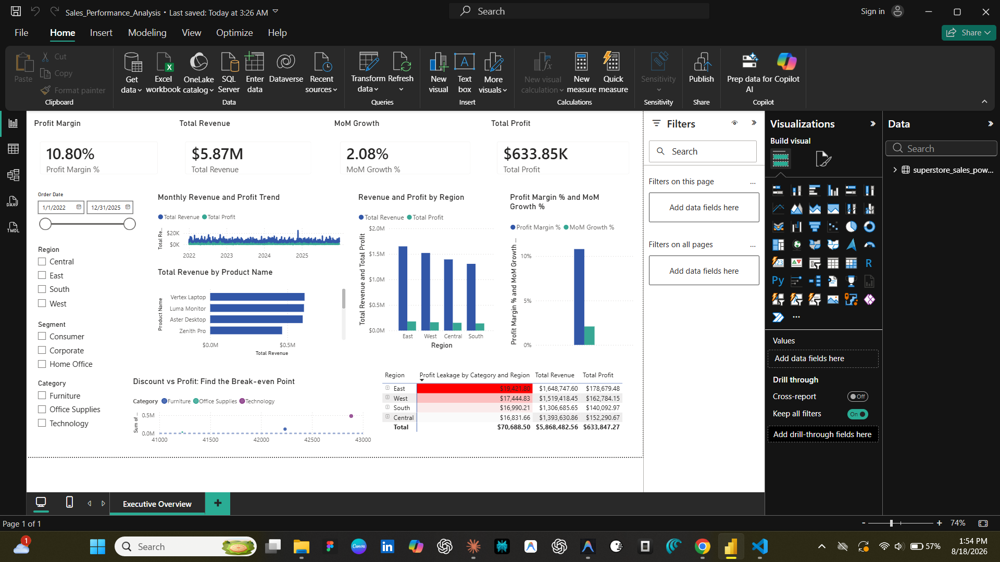

# Sales Performance Analysis — Superstore Retail Dataset

An end-to-end sales performance analysis project covering data cleaning, exploratory
data analysis in Python, and an interactive Power BI dashboard — built around one
central question: **how much profit is being lost to over-discounting, and where
exactly is it happening?**

## Dashboard Preview



The Power BI dashboard includes KPI cards (Profit Margin %, Total Revenue, MoM
Growth %, Total Profit), a monthly revenue/profit trend, regional performance
comparison, top products by revenue, a discount-vs-profit breakeven view, and a
**Profit Leakage table** with conditional formatting highlighting the
worst-performing region/category combinations.

## Project Structure

```
sales-performance-analysis/
├── data/
│   ├── raw/
│   │   └── superstore_sales_raw.csv            # raw export (5,660 rows)
│   └── cleaned/
│       ├── superstore_sales_cleaned.csv          # cleaned, feature-engineered dataset
│       ├── summary_product_performance.csv
│       ├── summary_region_performance.csv
│       ├── summary_segment_performance.csv
│       └── summary_profit_leakage_combinations.csv
├── notebooks/
│   └── analysis.ipynb                            # full EDA + Profit Leakage Analysis
├── scripts/
│   ├── generate_data.py                          # synthetic raw dataset generator
│   └── clean_data.py                             # raw → cleaned pipeline
├── visuals/                                        # charts exported from the notebook
├── dashboard/
│   └── executive_overview.png                     # Power BI dashboard screenshot
└── requirements.txt
```

## Dataset

A retail sales dataset in the style of the classic Superstore dataset — 5,660 raw
line items spanning 2021–2024, with realistic unit economics per sub-category.
The raw export includes intentional data-quality issues (missing values, exact
duplicates, and five inconsistent date formats) to mirror what a real raw export
looks like before cleaning.

Columns: `Order ID`, `Order Date`, `Ship Date`, `Customer Name`, `Segment`,
`Region`, `Category`, `Sub-Category`, `Product Name`, `Sales`, `Quantity`,
`Discount`, `Profit`.

## How to Reproduce

```bash
pip install -r requirements.txt

# 1. Regenerate the raw dataset (optional — already included)
python scripts/generate_data.py

# 2. Clean it
python scripts/clean_data.py

# 3. Run the analysis notebook
jupyter nbconvert --to notebook --execute --inplace notebooks/analysis.ipynb
```

## Data Cleaning (`scripts/clean_data.py`)

- Parses 5 inconsistent date formats into proper datetimes
- Imputes missing values contextually — e.g. a missing `Profit` value is
  reconstructed from that sub-category's typical margin at the same discount
  level, rather than dropped or filled with a flat average
- Removes exact duplicate rows and corrects inverted ship/order dates
- Engineers new columns: `Profit Margin (%)`, `Order Processing Time (Days)`,
  `Month-Year`, `Discount Bucket` (Low/Medium/High), `Quarter`, `Unit Price`, and
  `Is Loss Making`

## Exploratory Analysis (`notebooks/analysis.ipynb`)

1. Data overview and sanity checks
2. Monthly and quarterly revenue/profit trends
3. Top 10 best-selling products and top 10 least profitable products
4. Regional performance comparison
5. Discount vs. Profit relationship — empirically finds the discount % threshold
   (~28%) where average profit per line item turns negative
6. Customer segment analysis — revenue share vs. profit share by segment
7. **Profit Leakage Analysis (headline insight)** — quantifies exactly how much
   profit is lost to over-discounting, broken down by Category, Region, and the
   top 5 most profit-draining Product × Discount combinations

All charts are saved to `visuals/` as PNGs.

## Key Insight

Over-discounting past the ~28% threshold accounts for a substantial share of
total realized profit — and that leakage is concentrated in specific
Category/Region pairs rather than spread evenly across the business. Capping
discretionary discounting at that threshold, with manager approval required
above it, targets the exact combinations responsible for most of the loss.

## Tools Used

Python (Pandas, NumPy, Matplotlib, Seaborn), Jupyter Notebook, Power BI Desktop
(DAX measures, interactive slicers, conditional formatting).
